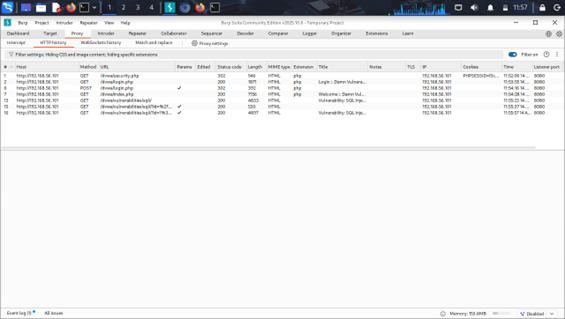
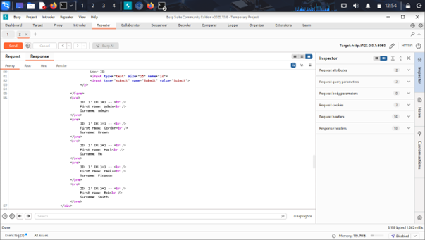
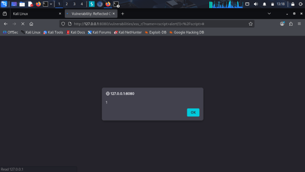
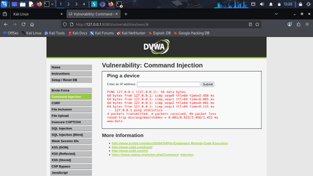
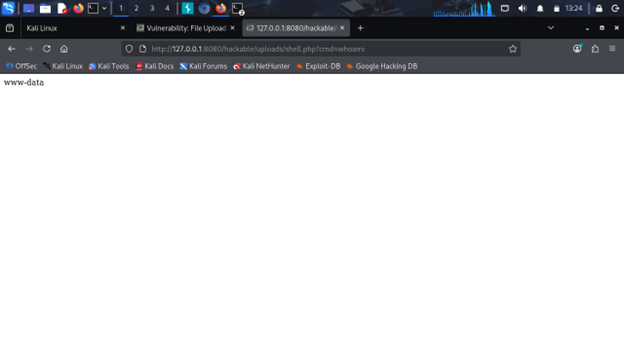

# 🔐 Web Application Security Assessment

## 📌 Overview

In this project, I performed a hands-on security assessment of a web application in a controlled environment. The goal was to understand how real-world vulnerabilities work, how attackers exploit them, and how they can be fixed.

## 🎯 What I Focused On

* Finding common web vulnerabilities
* Exploiting them safely to understand impact
* Documenting each step clearly
* Suggesting practical fixes

## 🛠️ Tools I Used

* Burp Suite for intercepting and modifying requests
* Kali Linux as the testing environment
* Firefox for interacting with the application

## 🧪 How I Approached It

I started by exploring the application and identifying input fields that could be vulnerable.
Then I used Burp Suite to intercept requests and test different payloads.
Once a vulnerability was confirmed, I captured screenshots and documented the proof of concept along with its impact.

## 🚨 Key Vulnerabilities I Worked On

### 🔴 SQL Injection

Used crafted inputs to bypass authentication and access database records.

### 🟠 Cross-Site Scripting (XSS)

Injected scripts that executed in the browser to understand client-side risks.

### 🔴 Command Injection

Executed system-level commands through input fields to demonstrate server compromise.

### 🔴 Unrestricted File Upload

Uploaded a malicious file to simulate remote code execution.

## 📊 Risk Summary

| Vulnerability     | Severity |
| ----------------- | -------- |
| SQL Injection     | High     |
| XSS               | Medium   |
| Command Injection | Critical |
| File Upload       | Critical |

## 📷 Screenshots

## 📷 Proof of Concept

### 🔴 SQL Injection

### 🟠 Cross-Site Scripting (XSS)

### 🔴 Command Injection

### 🔴 Unrestricted File Upload

## 📄 Report

A detailed report is included in this repository explaining each vulnerability, payload, impact, and fix.

## 💡 What I Learned

* How attackers actually think and approach applications
* The importance of input validation and secure coding
* How small mistakes can lead to critical vulnerabilities
* How to document security findings professionally

## ✅ Recommendations

* Validate and sanitize all user inputs
* Avoid unsafe system-level operations
* Use secure development practices
* Regularly test applications for vulnerabilities

## ⚠️ Disclaimer

This project was done purely for learning purposes in a controlled environment.

